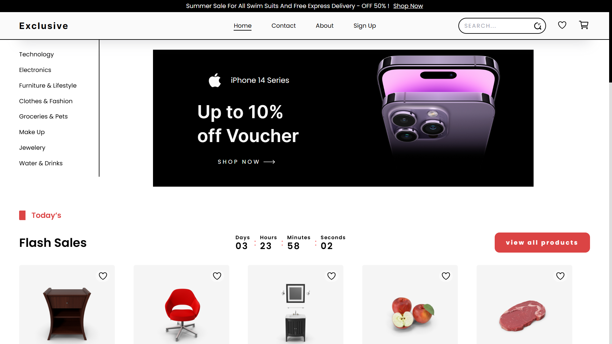

# E store
An e-commerce demo project built with React.js and styled using Tailwind CSS. This project showcases how to build a functional store interface, including features like product listings, a shopping cart, and user authentication. It's designed to help developers learn how to integrate front-end technologies like React and Tailwind CSS while simulating a real-world e-commerce store experience.




## Features
- **Contains products in several categories:** Electronic - Mobile Phones - Beauty and Mack up - Furniture - Clothes - Jewellery - Drinks.
- **Page for your preferred products:** You can have a favourite list to catch up later.
- **Cart page:** You can add the products you will buy to the cart.
- **120 Products:** We have used four demo store APIs, allowing us to display more than 120 products in different categories.
- **You can do Your shopping based on category:** You can shop by category to easily navigate through our demo store. With over 120 products available, the category feature helps prevent being overwhelmed by organizing the products into distinct groups.
- **Search feature:** If you are looking for a certain product you can easily search for it using our search input instead of getting stuck in the whole store.
- **Sale Timer:** We have implemented a sale timer to inform you of the remaining time until the sale ends.
- **Responsive Design:** The store is designed to be fully responsive, ensuring a seamless browsing experience across all devices which makes user able to access the store on whatever device he has.
- **Contact me:** We have provided a page to contact the developer himself in case you have a recommendation. It will be much considered.
- **🆕Product Page:** Providing the user the ability to display a product with its details on a separate page.

## Coming Soon:
- **Sign in:** We are currently working on adding the ability to register in the store via email.


## Technologies Used
- **React** for building the user interface.
- **CSS/SASS/TailwindCSS** for styling the app.
- **localStorage** to store user data.

## Setup Instructions

1. Clone this repository:
   ```bash
   git clone https://github.com/GADMuhammad/demo-store.git
